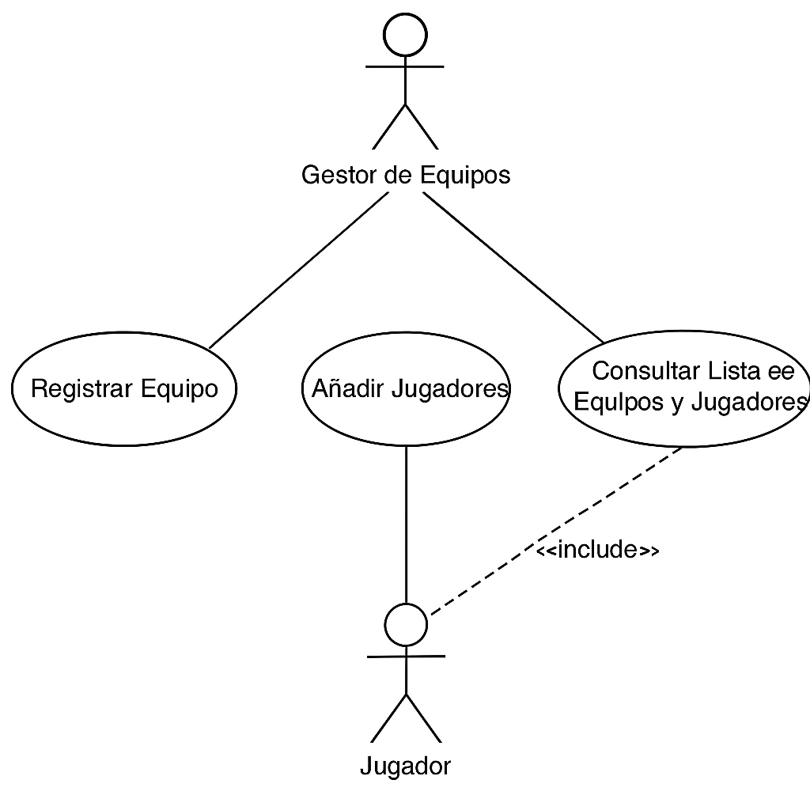
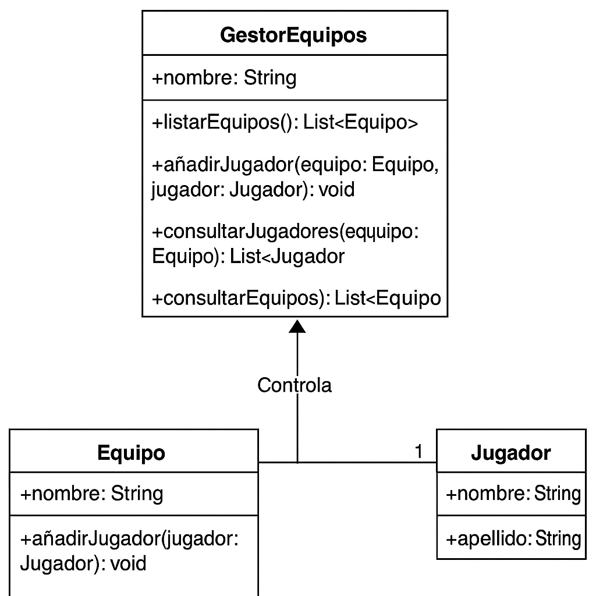

# Sistema de Gestión de Equipos y Jugadores

## Autor

Xabier Lopez Ibeas  
https://github.com/eerusoo


## Descripción del Proyecto

Repositorio: [enlace a tu repositorio de GitHub]

Este proyecto implementa el modelado de un sistema para la gestión de equipos y jugadores de eSports utilizando diagramas UML.

## Diagramas UML

### Diagramas de Casos de Uso

- **Registrar equipo** 
- **Añadir jugador a equipo** 
- **Consultar lista de equipos y jugadores** 

### Diagrama de Clases



## Estructura del Proyecto

```
torneo-esports-uml/
├── src/
│   ├── es/empresa/torneo/
│       ├── modelo/
│       ├── control/
│       ├── vista/
│       └── Main.java
├── diagrams/
│   ├── teamRegister-useCase.png
│   ├── addPlayer2Team-useCase.png
│   ├── viewListTeamsAndPlayers-useCase.png
│   ├── clases.png
├── README.md
├── .gitignore
```

## Instalación y Ejecución

1. Clonar el repositorio:
   ```bash
   git clone https://github.com/usuario/torneo-esports-uml.git
   ```
2. Compilar y ejecutar el proyecto:
   ```bash
   cd src
   javac es/empresa/torneo/Main.java
   java es.empresa.torneo.Main
   ```

## Justificación del Diseño

El diseño diferencia las responsabilidades en el sistema: entidades (Equipo, Jugador) y controladores (GestorEquipos). Se garantiza modularidad y facilidad de mantenimiento.

## Conclusiones

Este trabajo ayuda a entender el modelado estructural y funcional en UML, mejorando la capacidad de análisis y diseño de sistemas.
